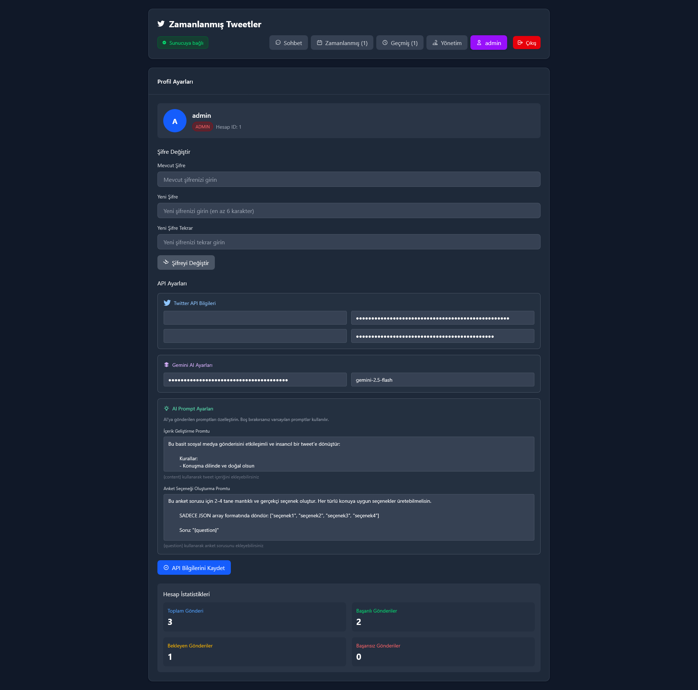
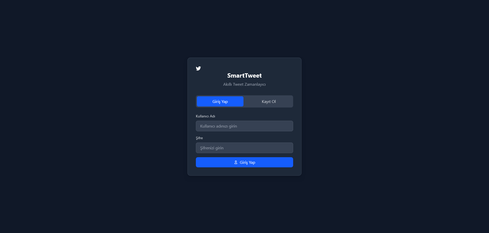

# 🧠 SmartTweet - AI Destekli Twitter/X Yönetim Platformu

[](https://nodejs.org)
[](https://reactjs.org)
[](LICENSE)
[](README.md)

**SmartTweet**, AI destekli içerik geliştirme ve akıllı zamanlama özelliklerini birleştiren kapsamlı bir Twitter/X yönetim platformudur. Türk kullanıcılar için özel olarak geliştirilmiş olup, çok kullanıcılı destek, rol tabanlı erişim kontrolü ve Twitter/X ile Google Gemini AI'nin kusursuz entegrasyonunu sunar.

## ✨ Temel Özellikler

### 🤖 AI Destekli İçerik Oluşturma

- **Akıllı İçerik Geliştirme** - Google Gemini kullanarak basit fikirleri etkileyici tweet'lere dönüştürün
- **Zeki Anket Oluşturma** - Otomatik anket seçeneği çıkarma veya oluşturma
- **Özelleştirilebilir AI Komutları** - Kullanıcıya özel geliştirme şablonlarıyla AI davranışını kişiselleştirin
- **Önizleme Sistemi** - Yayınlamadan önce AI geliştirilmiş içeriği görün

### 👥 Çok Kullanıcılı Mimari

- **Rol Tabanlı Erişim Kontrolü** - Detaylı izinlerle admin ve kullanıcı rolleri
- **Kullanıcıya Özel API Bilgileri** - Her kullanıcı kendi Twitter ve Gemini API anahtarlarını yönetir
- **Kullanıcı Yönetimi** - Kullanıcı hesapları oluşturma ve yönetme için admin paneli
- **Güvenli Kimlik Doğrulama** - Otomatik temizleme ile token tabanlı oturumlar

### 📅 Gelişmiş Zamanlama

- **Esnek Zamanlama** - Tweet'leri ve anketleri gelecek yayınlama için zamanlayın
- **GMT+3 Zaman Dilimi Desteği** - Türkiye saat dilimine özel olarak geliştirildi
- **Gerçek Zamanlı Geri Sayım** - Gönderilerin ne zaman yayınlanacağını tam olarak görün
- **Durum Takibi** - Bekleyen, yayınlanan, başarısız ve iptal edilen gönderileri izleyin

### 📊 İçerik Yönetimi

- **Gönderi Geçmişi** - Yayınlanan tüm içerikleri zaman damgalarıyla takip edin
- **Zamanlanmış Gönderi Yönetimi** - Zamanlanmış içerikleri düzenleyin, iptal edin veya kalıcı olarak silin
- **Ayrım Prensibi** - Anlık ve zamanlanmış gönderiler arasında net ayrım
- **Veritabanı Migration Sistemi** - Sürüm kontrolü ile otomatik şema güncellemeleri

## 🏗️ Mimari

SmartTweet modern, ölçeklenebilir üç katmanlı mimariye sahiptir:

```text
┌─────────────────┐    ┌──────────────────┐    ┌─────────────────┐
│   Frontend      │    │     Backend      │    │   Harici API'ler│
│   (React)       │◄──►│   (Express)      │◄──►│  Twitter/Gemini │
│                 │    │                  │    │                 │
│ • Türkçe UI     │    │ • REST API'ler   │    │ • Kullanıcıya   │
│ • Gerçek zamanlı│    │ • MCP Araçları   │    │   özel kimlik   │
│ • TailwindCSS   │    │ • SQLite DB      │    │ • Hız sınırları │
└─────────────────┘    └──────────────────┘    └─────────────────┘
```

### 🔧 Teknoloji Yığını

| Bileşen | Teknoloji | Amaç |
|---------|-----------|------|
| **Frontend** | React 19 + Vite + TailwindCSS | Gerçek zamanlı güncellemeli Türkçe UI |
| **Backend** | Node.js + Express + MCP SDK | REST API'ler ve AI araç entegrasyonu |
| **Veritabanı** | SQLite + Better-SQLite3 | Hızlı, gömülü veri depolama |
| **AI Motoru** | Google Gemini | İçerik geliştirme ve anket oluşturma |
| **Sosyal API** | Twitter API v2 | Tweet ve anket yayınlama |
| **Zamanlama** | Node-cron | Otomatik gönderi yayınlama |

## 📸 Ekran Görüntüleri

### 🗨️ Sohbet Arayüzü


*AI destekli içerik geliştirme ve anlık gönderi arayüzü*

### 📅 Zamanlama Yönetimi  


*Zamanlanmış gönderilerin yönetimi ve geri sayım*

### 👤 Kullanıcı Profili


*API kimlik bilgileri ve özelleştirilebilir AI komutları*

### 🔐 Giriş Ekranı


*Kullanıcı girişi ve hesap oluşturma arayüzü*

### 📋 Ön Gereksinimler

- **Node.js 18+** - [Buradan indirin](https://nodejs.org)
- **Twitter Geliştirici Hesabı** - API v2 erişimi ile [buradan başvurun](https://developer.twitter.com)
- **Google AI Studio API Anahtarı** - [Anahtarınızı alın](https://aistudio.google.com/app/apikey)

### ⚡ Kurulum

1. **Projeyi klonlayın**

   ```bash
   git clone https://github.com/KilimcininKorOglu/SmartTweet.git
   cd SmartTweet
   ```

2. **Ortam değişkenlerini ayarlayın**

   `server/.env` dosyası oluşturun:

   ```env
   # Google Gemini AI (Gerekli)
   GEMINI_API_KEY=your_gemini_api_key
   
   # Twitter API v2 (Gerekli)
   TWITTER_API_KEY=your_twitter_api_key
   TWITTER_API_SECRET=your_twitter_api_secret
   TWITTER_ACCESS_TOKEN=your_twitter_access_token
   TWITTER_ACCESS_TOKEN_SECRET=your_twitter_access_token_secret
   
   # Yerelleştirme
   TZ=Europe/Istanbul
   LOCALE=tr-TR
   ```

   `frontend/.env` dosyası oluşturun:

   ```env
   VITE_LOCALE=tr-TR
   VITE_TIMEZONE=Europe/Istanbul
   ```

3. **Bağımlılıkları yükleyin**

   ```bash
   # Backend
   cd server && npm install
   
   # Frontend
   cd ../frontend && npm install
   ```

4. **Uygulamayı başlatın**

   ```bash
   # Terminal 1: Backend'i başlat
   cd server && npm start
   
   # Terminal 2: Frontend'i başlat
   cd frontend && npm run dev
   ```

5. **Uygulamaya erişin**

   [http://localhost:5173](http://localhost:5173) adresini açın ve ilk admin hesabınızı oluşturun!

## 💡 Nasıl Çalışır

SmartTweet, sezgisel Türkçe arayüzü ile beş ana bölümden oluşur:

### 🗨️ **Sohbet** - Anlık Gönderi

- Sohbet arayüzünde içeriğinizi yazın
- AI destekli önizleme ile geliştirme önerilerini alın
- Hemen yayınlayın veya daha sonra için zamanlayın
- Türkçe sorular için otomatik anket algılama

### 📅 **Zamanlanmış** - Zamanlama Yönetimi

- Tüm yaklaşan zamanlanmış gönderileri görüntüleyin
- Yayınlamadan önce içerik ve zamanlamayı düzenleyin
- Yayınlanmaya gerçek zamanlı geri sayım
- Gönderileri iptal edin veya kalıcı olarak silin

### 📖 **Geçmiş** - İçerik Arşivi

- Daha önce yayınlanan tüm içeriklere göz atın
- Oluşturulma ve yayınlanma zaman damgalarını görüntüleyin
- Zaman içindeki gönderi aktivitenizi takip edin

### 👤 **Profil** - Kişisel Ayarlar

- Twitter ve Gemini API kimlik bilgilerinizi yönetin
- AI geliştirme komutlarını özelleştirin
- Şifre ve hesap ayarlarını değiştirin
- Kolay tanımlama için mor temalı arayüz

### 🛡️ **Yönetim** - Kullanıcı Yönetimi *(Sadece Admin)*

- Kullanıcı hesapları oluşturun ve yönetin
- Rol atayın (Admin/Kullanıcı)
- Şifreleri sıfırlayın ve kullanıcı adlarını güncelleyin
- Sistem genelindeki aktiviteyi izleyin

## 🔧 Geliştirme

### Kullanılabilir Komutlar

**Backend Geliştirme:**

```bash
cd server
npm start          # Nodemon ile otomatik yeniden başlatmalı geliştirme
node index.js      # Üretim başlatma
```

**Frontend Geliştirme:**

```bash
cd frontend
npm run dev        # Geliştirme sunucusu (hot reload)
npm run build      # Üretim build'i
npm run lint       # ESLint kod kontrolü
npm run preview    # Üretim build önizlemesi
```

### Proje Yapısı

```bash
SmartTweet/
├── 📁 server/              # Backend API & AI Araçları
│   ├── index.js           # Express sunucu + MCP entegrasyonu
│   ├── database.js        # SQLite işlemleri & migrasyonlar
│   ├── scheduler.js       # Cron tabanlı gönderi yayınlama
│   ├── migrate.js         # Veritabanı migration sistemi
│   └── mcp.tool.js        # AI destekli içerik araçları
├── 📁 frontend/           # React Frontend
│   └── src/App.jsx        # Ana uygulama bileşeni
├── 📁 client/             # MCP İstemci (test)
└── 📄 CLAUDE.md           # AI geliştirme kılavuzu
```

## 🌟 Neden SmartTweet?

### ✅ **Üretim Hazır**

- Rol tabanlı erişim kontrolü ile çok kullanıcılı kimlik doğrulama
- Sorunsuz güncellemeler için otomatik veritabanı migrasyonları
- Kapsamlı loglama ile hata dirençli zamanlama sistemi
- Doğru tarih işleme ile Türkiye saat dilimi (GMT+3) desteği

### 🚀 **Geliştirici Dostu**

- Anlık ve zamanlanmış gönderiler arasında net ayrım
- Dosya tanımlama ile kapsamlı loglama sistemi
- AI ajanları için Model Context Protocol (MCP) entegrasyonu
- Doğru hata işleme ile RESTful API tasarımı

### 🎯 **Kullanıcı Odaklı**

- Tam Türkçe arayüz ve kullanıcı deneyimi
- Güvenlik ve izolasyon için kullanıcıya özel API kimlik bilgileri
- Kişiselleştirilmiş içerik geliştirme için özel AI komut sistemi
- Gerçek zamanlı geri bildirim ve durum güncellemeleri

## 📚 API Dokümantasyonu

### Kimlik Doğrulama Endpoint'leri

```http
POST /api/login          # Kullanıcı kimlik doğrulama
POST /api/register       # Kullanıcı kaydı (ilk kullanıcı admin olur)
POST /api/logout         # Oturum sonlandırma
GET  /api/auth-status    # Kimlik doğrulama durumunu kontrol et
```

### İçerik Yönetimi

```http
POST /api/createPost           # Anlık tweet gönderimi
POST /api/createPoll           # Anlık anket oluşturma
POST /api/enhance-preview      # AI içerik önizlemesi
POST /api/schedule-post        # Gelecek gönderiler için zamanlama
GET  /api/scheduled-posts      # Zamanlanmış gönderileri görüntüle
GET  /api/posts-history        # Gönderi geçmişini görüntüle
```

### Kullanıcı Yönetimi *(Sadece Admin)*

```http
GET  /api/admin/users          # Tüm kullanıcıları listele
POST /api/admin/create-user    # Yeni kullanıcı oluştur
PUT  /api/admin/users/:id/role # Kullanıcı rolünü güncelle
```

## 🛠️ Katkıda Bulunma

1. Projeyi fork edin
2. Özellik dalı oluşturun: `git checkout -b feature/harika-ozellik`
3. Değişikliklerinizi commit edin: `git commit -m 'Harika özellik ekle'`
4. Dalınıza push edin: `git push origin feature/harika-ozellik`
5. Pull Request açın

## 📄 Lisans

Bu proje MIT Lisansı altında lisanslanmıştır - detaylar için [LICENSE](LICENSE) dosyasına bakın.

## 🆘 Destek

- **Sorunlar**: [GitHub Issues](https://github.com/KilimcininKorOglu/SmartTweet/issues)
- **Tartışmalar**: [GitHub Discussions](https://github.com/KilimcininKorOglu/SmartTweet/discussions)

## 🎯 Yol Haritası

- [ ] Çoklu platform desteği (LinkedIn, Facebook, Instagram)
- [ ] Gelişmiş analitik ve görüngü panosu
- [ ] Toplu içe/dışa aktarma işlevselliği
- [ ] İçerik şablonları ve kaydedilmiş taslaklar
- [x] Mobil uyumlu tasarım
- [x] Karanlık mod teması
- [ ] Gelişmiş zamanlama desenleri (tekrarlayan gönderiler)

---

<div align="center">

**Türk topluluğu için ❤️ ile yapıldı**

Faydalı buluyorsanız [⭐ bu projeyi yıldızlayın](https://github.com/KilimcininKorOglu/SmartTweet)!

</div>
