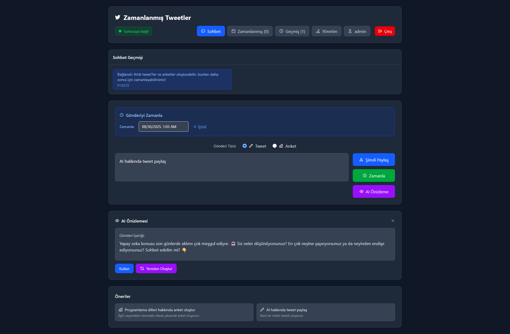
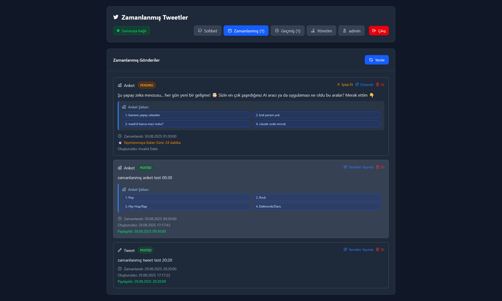
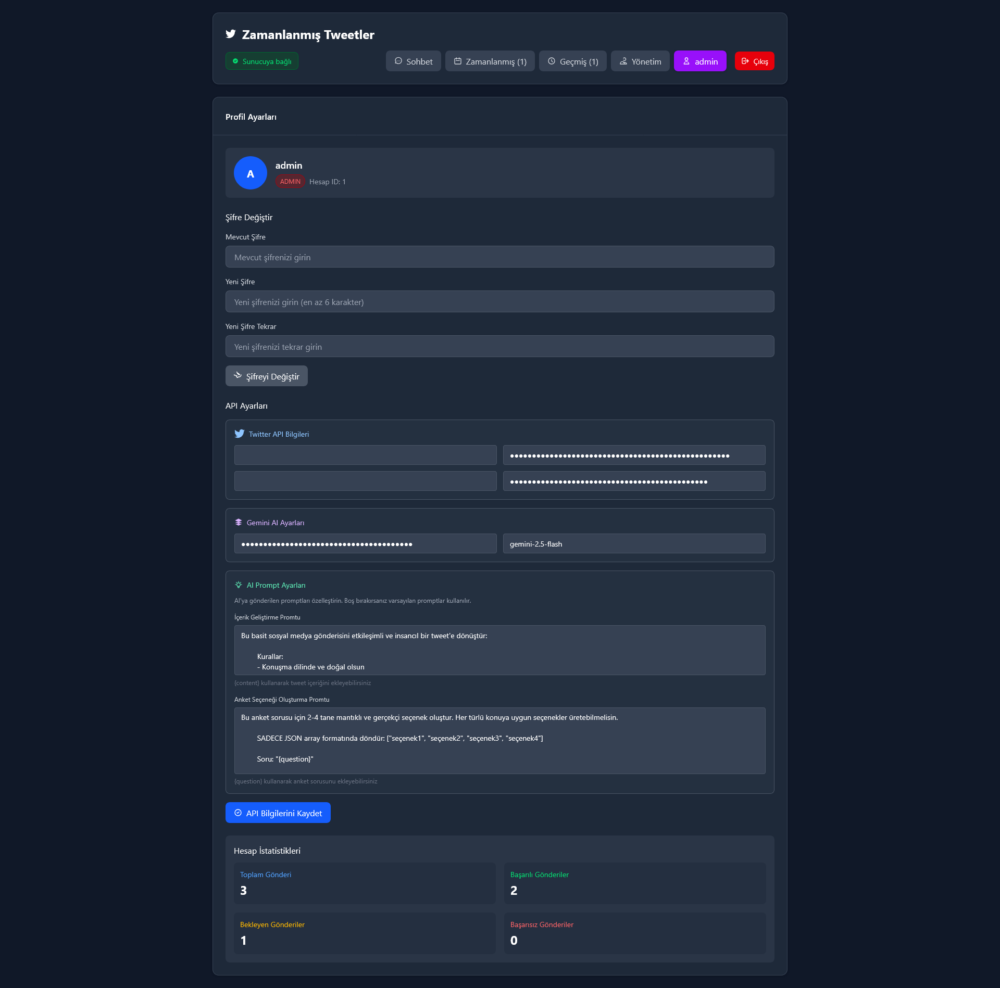

# 🧠 SmartTweet - AI-Powered Twitter/X Management Platform

[](https://nodejs.org)
[](https://reactjs.org)
[](LICENSE)
[](README_EN.md)

**SmartTweet** is a comprehensive Twitter/X management platform that combines AI-powered content enhancement with intelligent scheduling. Built specifically for Turkish users, it offers multi-user support, role-based access control, and seamless integration with Twitter/X and Google Gemini AI.

## ✨ Key Features

### 🤖 AI-Powered Content Creation

- **Smart Content Enhancement** - Transform simple ideas into engaging tweets using Google Gemini
- **Intelligent Poll Generation** - Auto-extract or generate relevant poll options
- **Customizable AI Prompts** - Personalize AI behavior with user-specific enhancement templates
- **Preview System** - See AI-enhanced content before publishing

### 👥 Multi-User Architecture

- **Role-Based Access Control** - Admin and user roles with granular permissions
- **Per-User API Credentials** - Each user manages their own Twitter and Gemini API keys
- **User Management** - Admin panel for creating and managing user accounts
- **Secure Authentication** - Token-based sessions with automatic cleanup

### 📅 Advanced Scheduling

- **Flexible Scheduling** - Schedule tweets and polls for future publishing
- **GMT+3 Timezone Support** - Built specifically for Turkish timezone
- **Real-Time Countdown** - See exactly when posts will be published
- **Status Tracking** - Monitor pending, posted, failed, and cancelled posts

### 📊 Content Management

- **Post History** - Track all published content with timestamps
- **Scheduled Post Management** - Edit, cancel, or permanently delete scheduled content
- **Clear Separation** - Distinct separation between instant and scheduled posts
- **Database Migration System** - Automatic schema updates with version control

## 🏗️ Architecture

SmartTweet features a modern, scalable three-tier architecture:

```text
┌─────────────────┐    ┌──────────────────┐    ┌─────────────────┐
│   Frontend      │    │     Backend      │    │  External APIs  │
│   (React)       │◄──►│   (Express)      │◄──►│  Twitter/Gemini │
│                 │    │                  │    │                 │
│ • Turkish UI    │    │ • REST APIs      │    │ • Per-user      │
│ • Real-time     │    │ • MCP Tools      │    │   credentials   │
│ • TailwindCSS   │    │ • SQLite DB      │    │ • Rate limits   │
└─────────────────┘    └──────────────────┘    └─────────────────┘
```

### 🔧 Technology Stack

| Component | Technology | Purpose |
|-----------|------------|---------|
| **Frontend** | React 19 + Vite + TailwindCSS | Real-time Turkish UI with live updates |
| **Backend** | Node.js + Express + MCP SDK | REST APIs and AI tool integration |
| **Database** | SQLite + Better-SQLite3 | Fast, embedded data storage |
| **AI Engine** | Google Gemini | Content enhancement and poll creation |
| **Social API** | Twitter API v2 | Tweet and poll publishing |
| **Scheduling** | Node-cron | Automated post publishing |

## 📸 Screenshots

### 🗨️ Chat Interface


*AI-powered content enhancement and instant posting interface*

### 📅 Schedule Management  


*Scheduled post management with real-time countdown*

### 👤 User Profile


*API credentials and customizable AI prompts*

### 🔐 Login Screen


*User authentication and account creation interface*

### 📋 Prerequisites

- **Node.js 18+** - [Download here](https://nodejs.org)
- **Twitter Developer Account** - [Apply here](https://developer.twitter.com) with API v2 access
- **Google AI Studio API Key** - [Get your key](https://aistudio.google.com/app/apikey)

### ⚡ Installation

1. **Clone the project**

   ```bash
   git clone https://github.com/KilimcininKorOglu/SmartTweet.git
   cd SmartTweet
   ```

2. **Setup environment variables**

   Create `server/.env` file:

   ```env
   # Google Gemini AI (Required)
   GEMINI_API_KEY=your_gemini_api_key
   
   # Twitter API v2 (Required)
   TWITTER_API_KEY=your_twitter_api_key
   TWITTER_API_SECRET=your_twitter_api_secret
   TWITTER_ACCESS_TOKEN=your_twitter_access_token
   TWITTER_ACCESS_TOKEN_SECRET=your_twitter_access_token_secret
   
   # Localization
   TZ=Europe/Istanbul
   LOCALE=tr-TR
   ```

   Create `frontend/.env` file:

   ```env
   VITE_LOCALE=tr-TR
   VITE_TIMEZONE=Europe/Istanbul
   ```

3. **Install dependencies**

   ```bash
   # Backend
   cd server && npm install
   
   # Frontend
   cd ../frontend && npm install
   ```

4. **Start the application**

   ```bash
   # Terminal 1: Start backend
   cd server && npm start
   
   # Terminal 2: Start frontend
   cd frontend && npm run dev
   ```

5. **Access the application**

   Open [http://localhost:5173](http://localhost:5173) and create your first admin account!

## 💡 How It Works

SmartTweet consists of five main sections with an intuitive Turkish interface:

### 🗨️ **Chat** - Instant Posting

- Write your content in the chat interface
- Get enhancement suggestions with AI-powered preview
- Publish immediately or schedule for later
- Automatic poll detection for Turkish questions

### 📅 **Scheduled** - Schedule Management

- View all upcoming scheduled posts
- Edit content and timing before publishing
- Real-time countdown to publication
- Cancel or permanently delete posts

### 📖 **History** - Content Archive

- Browse all previously published content
- View creation and publication timestamps
- Track your posting activity over time

### 👤 **Profile** - Personal Settings

- Manage your Twitter and Gemini API credentials
- Customize AI enhancement prompts
- Change password and account settings
- Purple-themed interface for easy identification

### 🛡️ **Admin** - User Management *(Admin Only)*

- Create and manage user accounts
- Assign roles (Admin/User)
- Reset passwords and update usernames
- Monitor system-wide activity

## 🔧 Development

### Available Commands

**Backend Development:**

```bash
cd server
npm start          # Development with auto-restart using nodemon
node index.js      # Production start
```

**Frontend Development:**

```bash
cd frontend
npm run dev        # Development server (hot reload)
npm run build      # Production build
npm run lint       # ESLint code checking
npm run preview    # Production build preview
```

### Project Structure

```bash
SmartTweet/
├── 📁 server/              # Backend API & AI Tools
│   ├── index.js           # Express server + MCP integration
│   ├── database.js        # SQLite operations & migrations
│   ├── scheduler.js       # Cron-based post publishing
│   ├── migrate.js         # Database migration system
│   └── mcp.tool.js        # AI-powered content tools
├── 📁 frontend/           # React Frontend
│   └── src/App.jsx        # Main application component
├── 📁 client/             # MCP Client (testing)
└── 📄 CLAUDE.md           # AI development guide
```

## 🌟 Why SmartTweet?

### ✅ **Production Ready**

- Multi-user authentication with role-based access control
- Automatic database migrations for seamless updates
- Error-resilient scheduling system with comprehensive logging
- Turkey timezone (GMT+3) support with proper date handling

### 🚀 **Developer Friendly**

- Clear separation between instant and scheduled posts
- Comprehensive logging system with file identification
- Model Context Protocol (MCP) integration for AI agents
- RESTful API design with proper error handling

### 🎯 **User Focused**

- Complete Turkish interface and user experience
- Per-user API credentials for security and isolation
- Custom AI prompt system for personalized content enhancement
- Real-time feedback and status updates

## 📚 API Documentation

### Authentication Endpoints

```http
POST /api/login          # User authentication
POST /api/register       # User registration (first user becomes admin)
POST /api/logout         # Session termination
GET  /api/auth-status    # Check authentication status
```

### Content Management

```http
POST /api/createPost           # Instant tweet posting
POST /api/createPoll           # Instant poll creation
POST /api/enhance-preview      # AI content preview
POST /api/schedule-post        # Schedule future posts
GET  /api/scheduled-posts      # View scheduled posts
GET  /api/posts-history        # View post history
```

### User Management *(Admin Only)*

```http
GET  /api/admin/users          # List all users
POST /api/admin/create-user    # Create new user
PUT  /api/admin/users/:id/role # Update user role
```

## 🛠️ Contributing

1. Fork the project
2. Create a feature branch: `git checkout -b feature/amazing-feature`
3. Commit your changes: `git commit -m 'Add amazing feature'`
4. Push to your branch: `git push origin feature/amazing-feature`
5. Open a Pull Request

## 📄 License

This project is licensed under the MIT License - see the [LICENSE](LICENSE) file for details.

## 🆘 Support

- **Issues**: [GitHub Issues](https://github.com/KilimcininKorOglu/SmartTweet/issues)
- **Discussions**: [GitHub Discussions](https://github.com/KilimcininKorOglu/SmartTweet/discussions)

## 🎯 Roadmap

- [ ] Multi-platform support (LinkedIn, Facebook, Instagram)
- [ ] Advanced analytics and insights dashboard
- [ ] Bulk import/export functionality
- [ ] Content templates and saved drafts
- [x] Mobile-responsive design
- [x] Dark mode theme
- [ ] Advanced scheduling patterns (recurring posts)

---

<div align="center">

**Made with ❤️ for the Turkish community**

If you find this useful, [⭐ star this project](https://github.com/KilimcininKorOglu/SmartTweet)!

</div>
